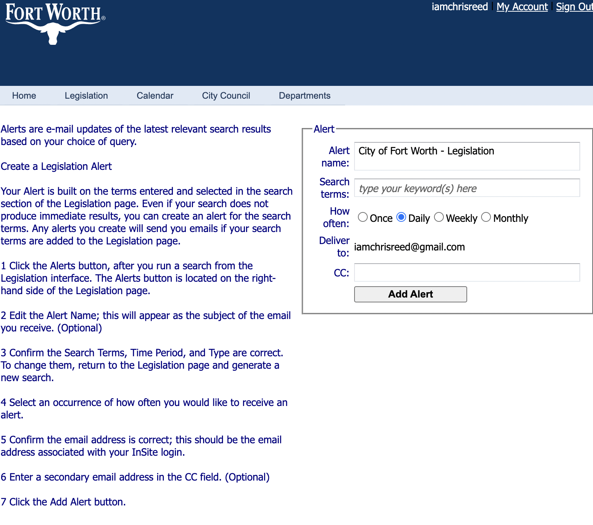
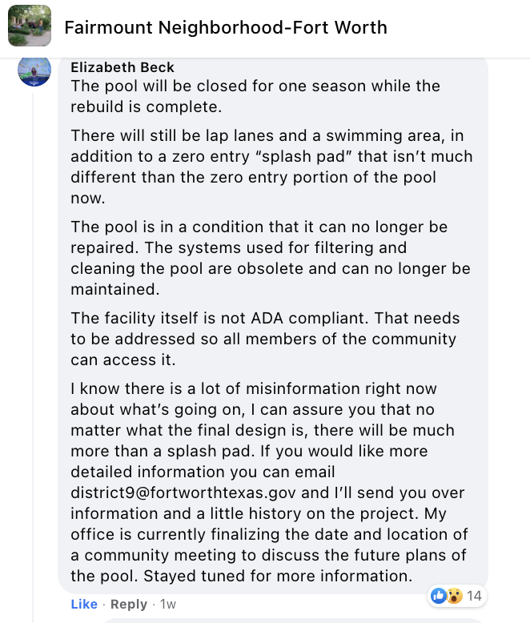
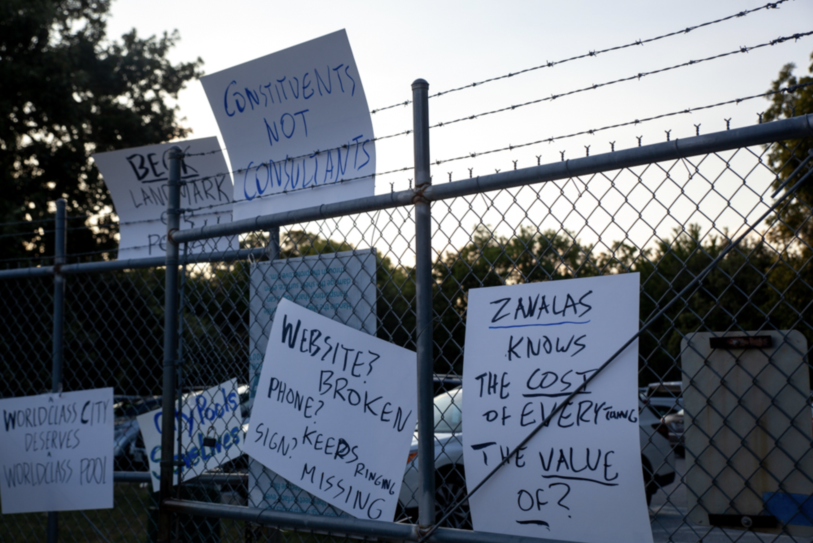
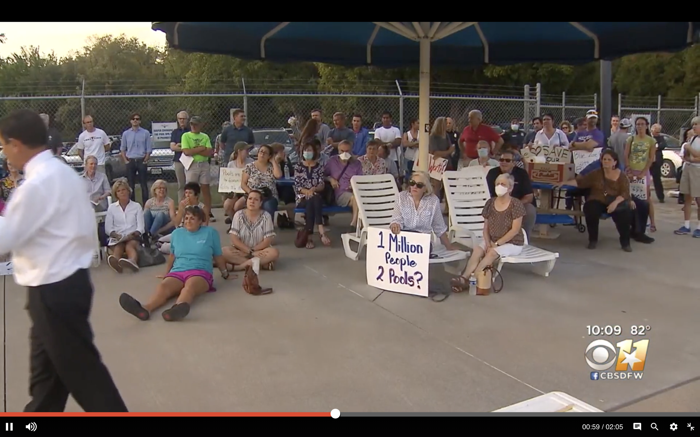
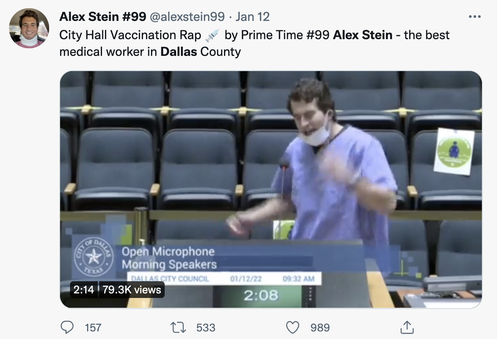
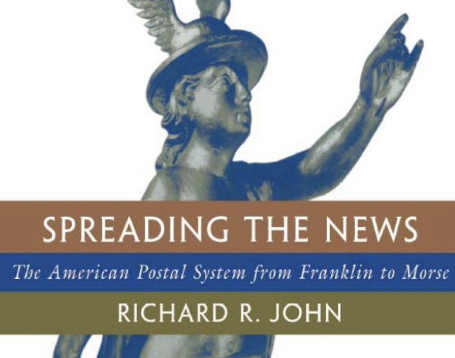
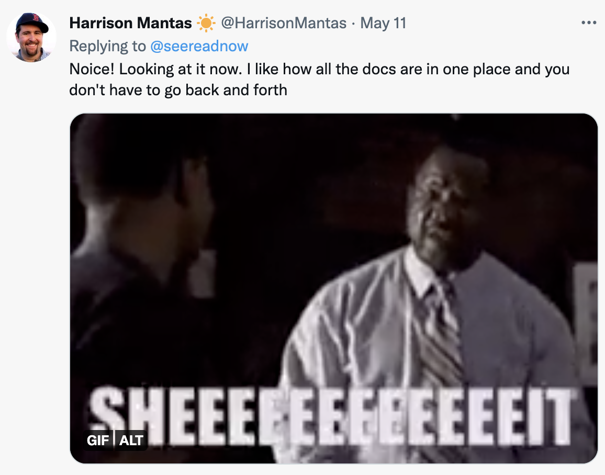

## <!--fit--> [Legigram](https://www.legigram.com)
### <!--fit-->  Rethinking Civic Tech

Chris Reed [@seereadnow](https:///twitter.com/seereadnow) | 2022.06.08 | [FullStackDFW.com](https://www.fullstackdfw.com) 

---

---

# <!-- fit --> Why?

---

---

---

---

---

# <!-- fit --> But really - why?

---

---

---

# <!-- fit --> “Time is really of the essence in some situations...

---

> ...If a meeting is on a Monday, and they release [agenda info] on Thursday or Friday, that doesn’t give people who care about a particular item on council’s agenda much time to discuss with neighbors or discuss with other interested people or groups. 
>
> Every moment counts.
> 
> [Angelo Trivisonno, on Neighbor Up CLE](https://neighborupcle.org/the-pace-of-passage-how-quickly-city-council-makes-laws-and-what-that-means-for-clevelanders/)

--- 

---

---

---

> Leaders rise to eminence by exploiting and manipulating the mood of the moment.  They define their aims by consulting focus groups rather than following their own perceptions.  They view the future as a projection forward of the familiar.
>
> Henry Kissinger

---

---

# Petition, emails, news stories...
## Not to mention a Reply All

---

---

----

----

# News coverage
- Editorial: Nostalgic Neighbors
- 10 O'clock News:  "actually had their voices heard"
- "Debate continues"
- City listens
- Scandal

---

----

---

# ☀️🏊‍♂️

Dallas: 17 pools
Austin: 32 pools + 11 pads
El Paso: 5 pools + 7 under construction
# Fort Worth: ...2?

---

# How can we evaluate?

---

# More coordinating, emails, tracking the agenda
but the city vision/plan needs work

---

---

# <!-- fit --> My related background
- Full stack dev
- 2010s and Civic Data
- Moving: Place and Politics
- Hurricanes, Winter Storms
- Swimming

---

# <!-- fit --> Legigram tech stack
- Next.js (javascript react "meta-framework")
- Tailwind
- SWR (stale while revalidate)
- Heroku (devops)
- Redis
- Logging
- Legistar

---

# <!-- fit --> Some goals
- Easier for me to view
- Faster, smart UX for journalists and like-minded folks
- Low cost
- Easy maintnenace
- Rot resistant
- "Progress"

---

# <!-- fit --> Some Civic Tech Qualms
- Believers: idealism
- Boondoggles: tech solutionism
- Bandwagons: hackathons
- Bounty: data
- Bitrot: one off

---

> Die Politik ist die Lehre vom Möglichen.
> [Politics is the _teaching_ of the possible.]
> - [Otto von Bismarck](https://books.google.de/books?id=UpUBAAAAYAAJ&pg=PA248&dq=%22die+Politik+ist+die+Lehre+vom+M%C3%B6glichen%22&redir_esc=y#v=onepage&q=%22die%20Politik%20ist%20die%20Lehre%20vom%20M%C3%B6glichen%22&f=false)

---

# Affordances
Tech changes what is possible

---

# <!-- fit --> Legistar is problematic
But so are other solutions
---

---

# Bias around tech solutionism – worse in public sector?
- Anchoring
- Extension neglect
- False priors
- Propect theory
- Self assessment
- Risk compensation
- Discounting of commons

---

# <!-- fit --> About cities

---

# <!-- fit --> Key Attributes
- Strong or weak mayor
- Non-partisan or partisan elections
- Home rule or not state

---

# <!-- fit --> Ratios of Representation
100k in a district. Maybe 8k vote for a council seat!
2x vote at state rep for same pop.
30x vote for fed rep for 3x population.

---

> The ethos of 'new managerialism' is stripping public services of moral and ethical values and replacing them with the market language of costs, efficiencies, profits and competition. Anything which is not easily quantified becomes undervalued or abandoned.
>
> [OpenDemocracy.net](https://www.opendemocracy.net/en/new-managerialism-in-education-organisational-form-of-neoliberalism/)

---

# <!-- fit --> What is a city?

> Plato defined the limits of the size of a city as the number of people who could hear the voice of a single orator: today those limits do not define a city but a civilization.
>
> Mumford, Technics and Civilization

---

# <!-- fit -->  [Crabgrass Frontier](https://www.amazon.com/Crabgrass-Frontier-Suburbanization-United-States/dp/0195049837) 
# Kenneth Jackson

---

# <!-- fit --> [Color of Law](https://www.amazon.com/Color-Law-Forgotten-Government-Segregated/dp/1631494538)
## <!-- fit --> Richard Rothstein

---

# <!-- fit --> And press, newsmedia, etc

---
# <!-- fit --> [Spreading the News](https://www.amazon.com/Spreading-News-American-Postal-Franklin/dp/0674833422) 
## <!--fit --> Richard R. John

---

# <!-- fit --> [Recorder](https://recorderfilm.com/)
## <!-- fit --> Matt Wolf

---

# <!-- fit --> [Spin](https://en.wikipedia.org/wiki/Spin_(1995_film))
## <!-- fit --> Brian Springer

---

# <!-- fit --> [Weiner](https://www.imdb.com/title/tt5278596/)
Josh Kriegman, Elyse Steinberg

---

# <!-- fit --> [Seen and Unseen](https://www.amazon.com/Seen-Unseen-Technology-Social-Justice/dp/1982180390/ref=sr_1_1?qid=1654549549&refinements=p_27%3AMarc+Lamont+Hill&s=books&sr=1-1&asin=1982180390&revisionId=&format=4&depth=1)
Mark Lamont Hill

---

# <!-- fit --> [How to be a Woman Online](https://www.amazon.com/How-Woman-Online-Surviving-Harassment/dp/1350267570)
Nina Jankowicz

---

# <!-- fit --> Organizing
- Emails
- Change.org
- Rallies
- Flyering and Postering
- Social media
- Local news

---

# <!-- fit --> Where does this go?
- Product managing
- Other cities
- Outreach to journalists
- Better browsing
- Partnering for more opportunities
- Notifications
- Auth
- Topics
- Discussion?

---

---

# <!-- fit --> Where are the humans in the loop?

---

# <!-- fit --> AI duh!

---

# <!-- fit --> Highlighting

---

# <!-- fit --> NERC via BERT
via [Hugging Face](https://huggingface.co/dslim/bert-base-NER-uncased)
c.f. [Towards Data Science](https://towardsdatascience.com/named-entity-recognition-ner-using-keras-bidirectional-lstm-28cd3f301f54)

---

<video autoplay="1" loop="1" playbackRate="0.1" width="800" src="./assets/legigram-session-tweet.mov"></video>

---

# <!-- fit --> Cleveland Rocks!
- Documenters
- @CleBillBot

---

---

---

---

---

## <!-- fit --> Thanks
## <!-- fit --> @seereadnow
