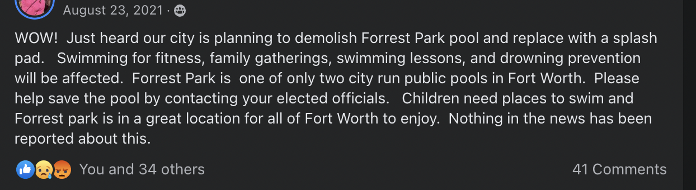
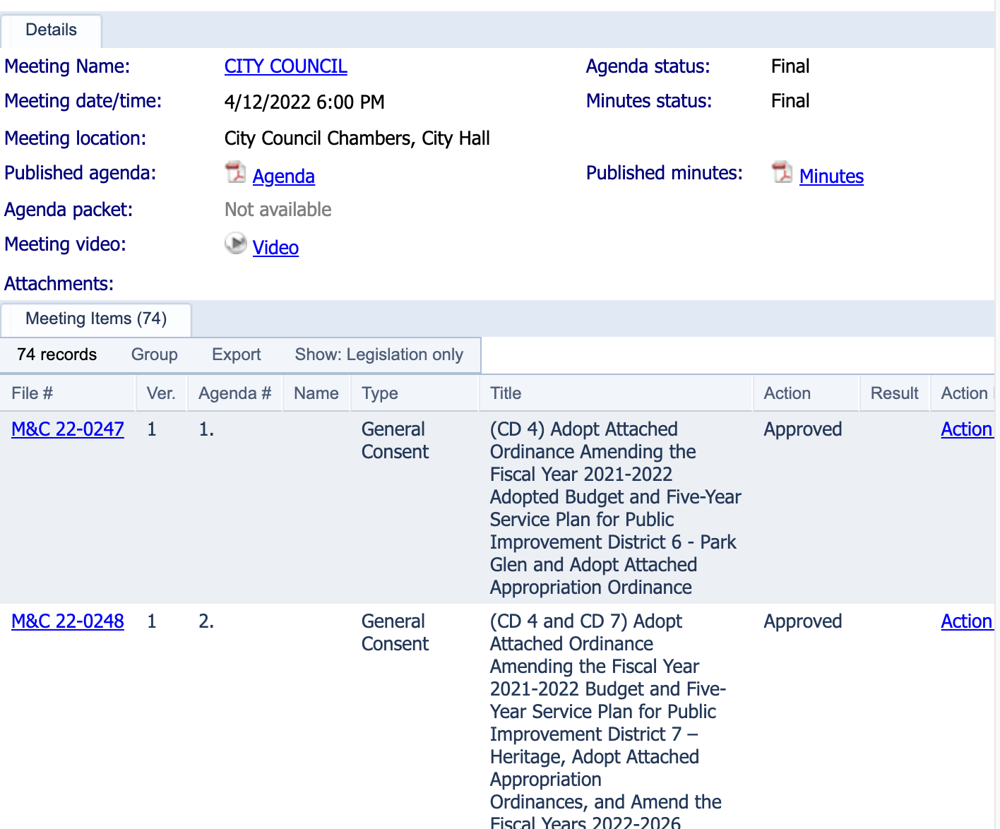
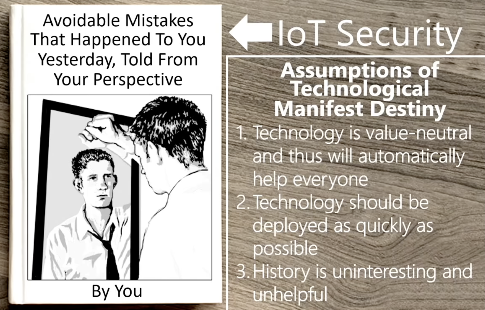
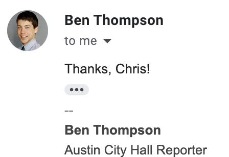
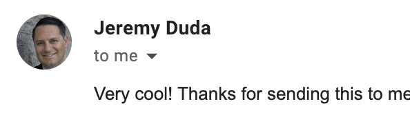

## <!--fit--> [Legigram.com](https://www.legigram.com)
### <!--fit-->  Rethinking Civic Tech

Chris Reed [@seereadnow](https:///twitter.com/seereadnow), [Super Basic](https://www.superbasic.xyz) – 2023.01.12 – [Google Developer Group Dallas](https://gdg.community.dev/events/details/google-gdg-dallas-presents-legigram-rethinking-civic-tech/)

---

## <!--fit-->This talk's promises to you
<!-- At the end of these 30 minutes, you will learn something you don't know about local American governance, civic engagement that will change how you think about your work in tech and make a difference how in you prioritize civic engagement
-->
### <!--fit--> 1. Gain a new perspective on how your work in tech  can affect other people   2. Increase your appetite and ability to engage with  civics

---
## <!--fit-->But first – thanks
### <!--fit-->Luke, Stacy, et al. at GDG Dallas  James Pierce at Super Basic  Fairmount and Fort Worth neighbors   Family and friends

---

## <!--fit--> What you are in for...
### <!--fit-->1. Why develop Legigram?  2. What is it? What does it have to do with civic tech?  3. DEMO  4. How does it work?   5. What's next?   6. Q&A 

---

## <!--fit--> 1. Why develop Legigram? 

---

### <!--fit--> Better access  to city council agendas

<!-- who has been, how did you know to go?, agenda, existing solution is slow, unusuable, reduces oversight -->

---

### <!--fit--> Wait...so...
#### <!--fit-->...what does city council do anyway?  And what is a city council agenda btw and  why does it matter?

<!-- policy making, permitting, zoning, contracts, operations... bitcoin mining --->

---

### <!-- fit --> “Time is really of the essence...

> If a meeting is on a Monday, and they release agenda info on Thursday or Friday, that doesn’t give people who care about a particular item on council’s agenda much time to discuss with neighbors or discuss with other interested people or groups. 
>
> Every moment counts.
> 
> – Angelo Trivisonno, author of [@CleBillBot](https://twitter.com/clebillbot), in [**Neighbor Up Cleveland**](https://neighborupcle.org/the-pace-of-passage-how-quickly-city-council-makes-laws-and-what-that-means-for-clevelanders/)

--- 

<!-- machine politics, weak mayor, city manager with oversight from council -->

---

### <!--fit -->

---

### <!--fit--> Faster review of agendas means...

#### <!--fit--> ⬆️ Understanding of legislative process   ⬆️ Civic engagement and oversight   ⬆️ Better press and better government

---

### <!--fit--> Ok – but why?
#### <!--fit--> We have elected reps, videos   and the agendas are online already...

--- 

---

---

---

## <!--fit --> Your city's website ➡️ 🤞  Luck ️➡️&nbsp;[Legistar](https://fortworthgov.legistar.com/Calendar.aspx)

---

<!-- Can't really search...don't click the body name...agenda PDF just downloads...-->

---

---

---

<!--  -->

<!-- --- -->

---

---

## <!-- fit --> Who has time for this?

---

*h/t to Howard Dierking in _Open Government_

and apologies to interest groups, journalists, civic society

---

### <!--fit--> Access to policy making is critical  for a functional democracy

---

### <!--fit-->  Why doesn't Granicus/Legistar fix this?

---

### <!-- fit --> Your persona doesn't matter to GovTech here
<!-- needs govtech compliance, business as usual vs.  needs civictech: citizen or journalist --->

---

### <!--fit--> GovTech Gap
Layer capture, Moats and platforms, De-facto standards, CivicTech Patches

---

### <!--fit--> Legigram's CivicTech "Why"
#### <!--fit---> 1. Personal + local motivation  2. GovTech Gap / CivicTech Patches   3. Long tail of interested users  4. Let's make software better for people

---

### <!--fit--> BEWARE
Tech solutionism – the old tire swing 

---

### <!---fit--> GovTech worse?
- Stakeholder incentives
- Extension neglect
- Disparate impact

### <!--fit-->h/t James Mickens   [Security talk at   USENIX Security 2018 ](https://www.youtube.com/watch?v=ajGX7odA87k&t=2808s)
*Why Do Keynote Speakers Keep Suggesting That Improving Security Is Possible?*

---

### <!--fit--> *The Art of Joining* <!--fit-->

> Tocqueville posited the **“art of joining”** in voluntary associations as the **“fundamental science” of democracy**.  He famously explained that “Americans of all ages, all conditions, and all minds” learned how to guard against such democratic perils as **excessive individualism, the tyranny of the majority, and the stifling effects of administrative centralization simply by “constantly joining together in groups.”**
>
>—Olivier Zunz, [HistPhil.org](https://histphil.org/2015/07/13/alexis-de-tocqueville-on-associations-and-philanthropy/)

---

### <!--fit--> 21st Century **Joining**
How does software fit?

---

### <!-- fit-->c.f. Change.org, FaceBook, Citizen, 

---

## <!--fit--> 2. So what is Legigram? 

---

### <!--fit--> Legigram helps you understand and  improve your city's policy-making

---

### <!--fit--> [Legigram.com](https://www.legigram.com) provides the fastest review  of government agendas, matters,   and related attachments for over  30 million local constituents across  25 localities...and counting

---

---

---

---

### <!--fit-->A facade to the public Legistar API
#### <!--fit--> * Legistar provides council agenda management SaaS  to most of the largest cities in the US.
<!-- $100MM revenue GovTech SaaS with funding from Vista -->

---
### <!--fit--> Some Quick Stats
#### <!--fit--> 1+ year old 10s of weekly users, 100s at peaks 25 local government bodies  30 million consituents

---

### <!--fit--> How to use Legigram
#### <!-- fit --> 1. Visit [legigram.com](https://www.legigram.com)  2. Click your city to explore recently updated agendas and matters 3. Filter matters and review attachments 4. Bookmark the page and check it weekly 5. The rest is up to you

---

---

---

---

### <!--fit--> Principles
#### <!-- fit -->Open-minded but skeptical User and community focused Fast use, Fast development, Fast iteration

To facilitate engagement
<!-- DM Sans -->

---

---

<!-- dorothy debose -->
---

### <!--fit--> The software is not the solution

---

## <!--fit--> 3. DEMO
[👀 legigram.com/places/fort-worth](https://www.legigram.com/places/fort-worth)

---

## <!--fit--> 4. How?

---

### <!--fit--> Lean Delivery
#### Think, make, check   Less work-in-progress  Iterate faster

👀 *Accelerate* by Fosgren et al. 

---

### <!--fit--> Legigram's Tech Stack
#### <!--fit--> Next.js: "Meta" Framework   Tailwind: CSS / UI   Cloudflare: Content Delivery Network 🚨   Heroku: DevOps and Hosting 🚨 Redis: Memory Store Legistar API: Data

<!-- why each, fast, but also robust,d accessibility -->

---

### <!--fit--> Legigram's Operations
#### <!--fit--> Google Drive: Planning spreadsheet  Github: Code Repo and Issues Email & Twitter: Outreach and Growth 🚨 Funding: Ko-fi ➡️ Patreon  Catch-all directory Changelog

---

---

---

---

---

### <!-- fit --> Step 5. Joining
#### <!--fit--> Learning Emailing Campaigning Local news and government relations

---

## <!-- fit --> 5. Next

---

### <!-- fit--> Where does Legigram go?
#### <!-- fit -->Increase usage Find (financial) support Add features

<!--
- Talk, talk, talk to empower individuals and communities
- Campaign for Phila, SF, Baltimore
- Growth support ideas...
    - On-premise agenda boards
    - Vendor product
    - Power user product
    - Donations or grants
- Improve journalist outreach
- Increase community awareness and support
- Use AI for entity recognition, summarization
-->>

---

### <!--fit--> 🤔
#### <!--fit--> So what's happening with the pool?

---

### <!--fit--> Avoid this 👉

----

### <!--fit--> Where is municipal tech headed  and how do GovTech and CivicTech fit?
Race for growth, Platform front-running, Transparency and surveillance, Complexity vs. innovation

---

### <!-- fit --> 📢 Check out  Full Stack DFW
#### <!-- fit --> _Advancing the tech community  across the stack & the metroplex_
- Attend monthly Lunch'n'Learn livestreams
- [Subscribe to DFW»FWD – the DFW Weekly Forward](https://dfwfwd.curated.co/) 
- Chat with other devs about all things DFW and tech

#### <!--fit--> 👉 Learn more at [fullstackdfw.com](https://www.fullstackdfw.com)

---

### <!--fit--> Did we?
#### <!--fit--> Share improved interface for browsing agendas and matters  Articulate a vision for improving municipal tech   Increase your appetite for civic tech as a means for better engagement

---

Q & A

## <!--fit--> [Legigram.com](https://www.legigram.com)
### <!--fit-->  Rethinking Civic Tech

Chris Reed [@seereadnow](https:///twitter.com/seereadnow), [Super Basic](https://www.superbasic.xyz) – 2023.01.12 – [Google Developer Group Dallas](https://gdg.community.dev/events/details/google-gdg-dallas-presents-legigram-rethinking-civic-tech/)

---

## <!--fit--> Appendix

---

### <!-- fit --> c.f. Other Council Agenda Efforts
- [intro.nyc](https://intro.nyc/) – NYC, visualization
- [Councilmatic](https://www.councilmatic.org/) - Chicago, comprehensive
- [Documenters](https://documenters.org/) - Mid-west, crowd-source, comprehensive
- [@CleBillBot](https://twitter.com/CleBillBot) – Cleveland matters real time

----

### <!-- fit --> c.f. Other ~Civic~ Tech Efforts (1/2)
- [GovTrack.us](https://www.govtrack.us/) - Federal law making
- [Ballotpedia](https://ballotpedia.org/) - Elections, Jurisdictions
- [OpenStates](https://openstates.org/) - State law making
- [Free Law Project](https://free.law/) - Courts and dockets

---

## <!-- fit --> c.f. Other ~Civic~ Tech Efforts (2/2)
- [Govinfo.gov](https://www.govinfo.gov/) - Gov initiative
- [How's My Driving NY](https://twitter.com/HowsMyDrivingNY) - Crowd surveillance
- [DoNotPay](https://donotpay.com/) – AI fights back

---

<!--
### My background
- Full stack dev
- 2010s and Civic Data
- Moving: Place and Politics
- Hurricanes, Winter Storms
- Swimming

---

### Some goals
- Easier for me to view
- Faster, smart UX for journalists and like-minded folks
- Low cost
- Easy maintenance
- Rot resistant
- "Progress"

---

###  Some Civic Tech Qualms
- Believers: idealism
- Boondoggles: tech solutionism
- Bandwagons: hackathons
- Bounty: data
- Bitrot: one off

---

---

---

##  Where are the humans in the loop?

---

> The ethos of 'new managerialism' is stripping public services of moral and ethical values and replacing them with the market language of costs, efficiencies, profits and competition. Anything which is not easily quantified becomes undervalued or abandoned.
>
> [OpenDemocracy.net](https://www.opendemocracy.net/en/new-managerialism-in-education-organisational-form-of-neoliberalism/)

---

We want to provide concise, accurate information to users. The app avoids creating unnecessary URLs that might create link rot after Legigram ends. To that end, we link to original documents and canonical Legistar views as much as possible.

That said, UX and UI are paramount. We emphasize the critical data along each steps of the agenda review process. We use a content delivery network, a memory store for API hits (which also help reduce the load on Legistar), server render components, and expires headers to accelerate page load. We adapt the layout adjust for screen sizes and click/tap experiences so that it's easy to navigate on most devices. The text should be scannable and readable so we picked a typeface, DM Sans, that excels in legibility even on small screens, and we try to rein in the long event titles and filenames.

## What exists to help us get better laws?
- Voting
- Donations and lobbying
- Councilperson comms
- Public info sessions
- Public meetings, video streams, advance notice
- Public comment periods

### Who is in the room?
#### Elected Officials
#### Staff
#### Affected parties
#### Interest groups
#### Press (?)
#### *Commenters
-->
